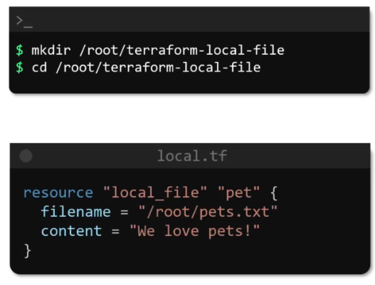

## Types of IAC Tools


## Why Terraform?


## Getting Started
- Terraform uses HCL (Hashicorp Configuration Language)
- It is a declarative language
- Every object Terraform manages is called a Resource
- A Resource can be an EC2 instance, S3 bucket, databases etc

## HCL Basics
- HCL file consist of blocks and arguments

``` 
<block> <parameters> {
    key1 = value1
    key2 = value2
}
```

What is block and parameters?
- It contains information about the platform that we want to create

<b>

Example: Create a file in local file system




Example: Create an S3 bucket


A simple Terraform workflow consists of 4 steps
- Write the configuration file
- Run init command
- Review the execution plan (run plan command)
- Apply changes (run apply command)


- `terraform show` command shows the detail of the executed workflow

In this previous example we use `local_file` in the tf file to create a file with the Terraform.
How do Terraform knows what `local_file` means? This is something we use terms like Providers, resource_types and etc


## Update and Destroy Infrastructure
- `terraform destroy` command will destroy everything